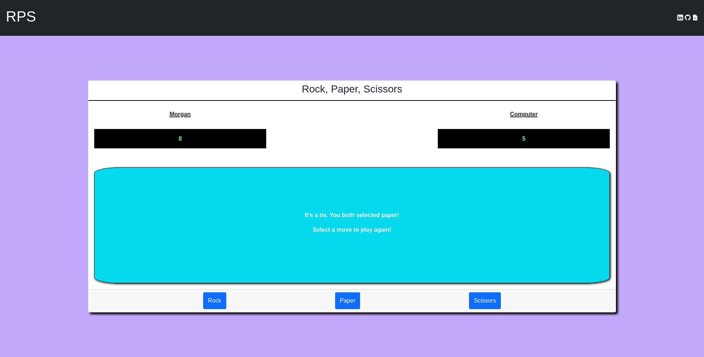

# Rock, Paper, Scissors

This project is a playable game of Rock, Paper, Scissors that you can play in the browser. The game is played against a computer making random decisions.

Check out the live demo [here](https://morgan-moreno25.github.io/rock-paper-scissors/).

---

## How It's Made

**_Tech Used_**: HTML, CSS, JavaScript, Bootstrap

For the structure and layout of the page I used HTML and CSS to create and position elements. I used Boostrap to add some pre-made components such as the Navbar and the Buttons.

The game starts out displaying a start game button which allows the user to input their name before the game begins. I used JavaScript to handle taking the players input and dynamically rendering the different elements of the game. I used ES6 classes to create objects that represent the Player and Computer, keeping up with their name and scores. I used the IIFE design pattern for the rest of my code in order to seperate the logic between the DOM and the Game.
